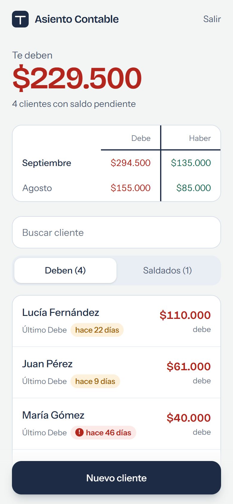
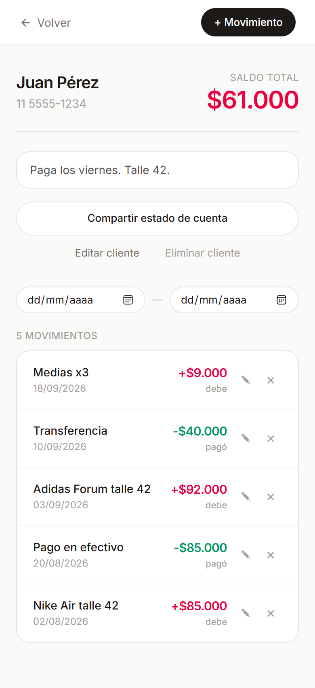
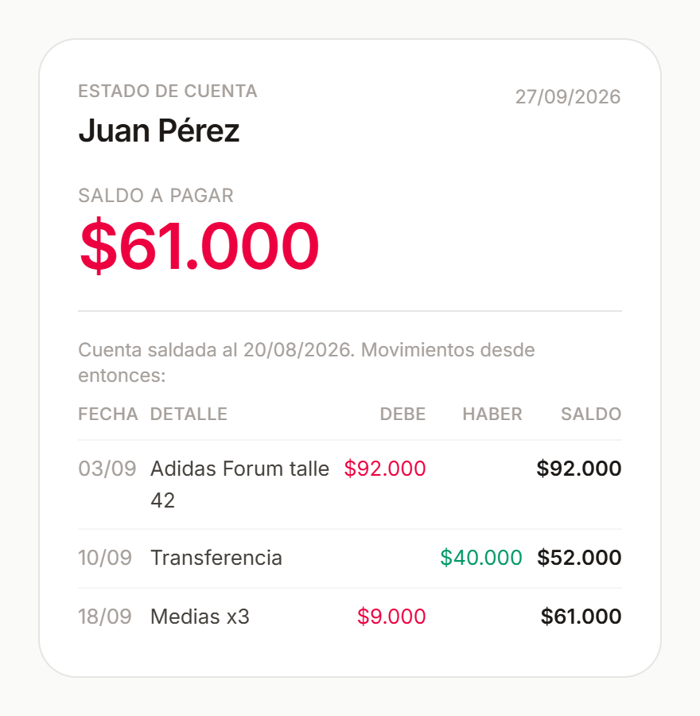

# Asiento Contable

Cuenta corriente digital para un negocio de reventa de zapatillas: reemplaza el cuaderno donde se anota quién debe y quién pagó. Cada cliente tiene su saldo calculado a partir de sus movimientos (Debe / Haber), y el estado de cuenta se le puede mandar por WhatsApp como imagen, con el desglose completo.

**Demo en vivo:** https://asiento-contable.vercel.app (se puede crear una cuenta de prueba; cada cuenta ve solo sus propios datos)

<p align="center">
  
  
  
</p>
<p align="center"><sub>Capturas con datos de ejemplo.</sub></p>

## Funcionalidades

- **Clientes** con teléfono y notas (ej. "paga a fin de mes"), búsqueda por nombre y pestañas "Deben" / "Saldados"
- **Movimientos Debe / Haber** por cliente, mostrados como una **cuenta T** (Debe a la izquierda, Haber a la derecha); se cargan con dos botones a mano y se editan tocándolos
- **Saldo automático** por cliente y **total a cobrar** del negocio
- **Debe y Haber del mes** (y del mes anterior), para ver si la deuda total crece o baja
- **Antigüedad de la deuda:** días desde el último Debe, con una etiqueta según urgencia (hasta 7 días, hasta 30, y más de 30 marcada como atrasada), que se distingue también sin depender del color
- **Estado de cuenta para el cliente:** una imagen con el saldo y el desglose renglón por renglón (fecha, detalle, Debe, Haber y saldo acumulado), lista para compartir por WhatsApp. Si la cuenta quedó saldada alguna vez, arranca desde ahí: muestra lo pendiente, no todo el historial
- **Filtro por período** y paginación ("Ver movimientos anteriores")
- **Fechas siempre en horario de Argentina**, esté donde esté el dispositivo
- **Instalable en el celular** como app (PWA), con su ícono
- **Login propio** y datos aislados por usuario con Row Level Security
- **Errores en lenguaje claro:** sin conexión, sesión vencida, datos inválidos o un login fallido se explican con qué pasó y qué hacer, nunca con el error técnico

## Stack

- **Frontend:** React 19 + Vite + Tailwind CSS
- **Backend:** Supabase (Postgres, Auth, Row Level Security)
- **Deploy:** Vercel

## Por qué está hecho así

- **Sin backend propio.** Supabase da autenticación, base de datos y reglas de acceso por fila (RLS) sin escribir una API. El frontend consulta la base directamente con la anon key, y la regla "cada usuario ve solo sus clientes" se garantiza en la base de datos, no en el cliente: ni un bug en el frontend puede mostrar datos de otro usuario.
- **El saldo no se guarda, se calcula.** Sale siempre de sumar Debe − Haber de los movimientos, así que no hay un número guardado que se pueda desincronizar con el detalle.
- **Pensada para el celular y para cualquiera.** Las acciones principales están abajo, al alcance del pulgar; los formularios suben desde abajo como en una app nativa; cada movimiento se edita tocándolo (en una pantalla táctil no hay "pasar el mouse"). Los textos usan palabras simples y sirven para cualquier comercio.
- **Identidad tomada de la contabilidad.** El diseño sale del libro contable: papel de libro mayor, tinta azul para el texto, rojo para el Debe y verde para el Haber, y la cuenta T como elemento central (también es el ícono de la app).
- **La imagen se arma en el dispositivo.** El estado de cuenta se dibuja con los mismos componentes de la app y se convierte en PNG en el celular (html-to-image), recién al tocar "Compartir", para no cargar el teléfono de trabajo innecesario. Se comparte con el menú nativo del sistema (Web Share API).

## Correr el proyecto localmente

```bash
git clone https://github.com/Coddek/Asiento-Contable.git
cd Asiento-Contable/cuentas-zapatillas
npm install
cp .env.example .env   # completar con tu proyecto de Supabase
npm run dev
```

Necesitás un proyecto de Supabase con dos tablas: `clientes` (`owner_id` referenciando al usuario, `nombre`, `telefono`, `notas`) y `movimientos` (`cliente_id`, `fecha`, `referencia`, `debe`, `haber`), y políticas RLS que filtren por `owner_id = auth.uid()`.

## Estado del proyecto

Funcional de punta a punta y en producción. Pendiente: recordatorio de deuda por WhatsApp con mensaje armado y tests automatizados.
